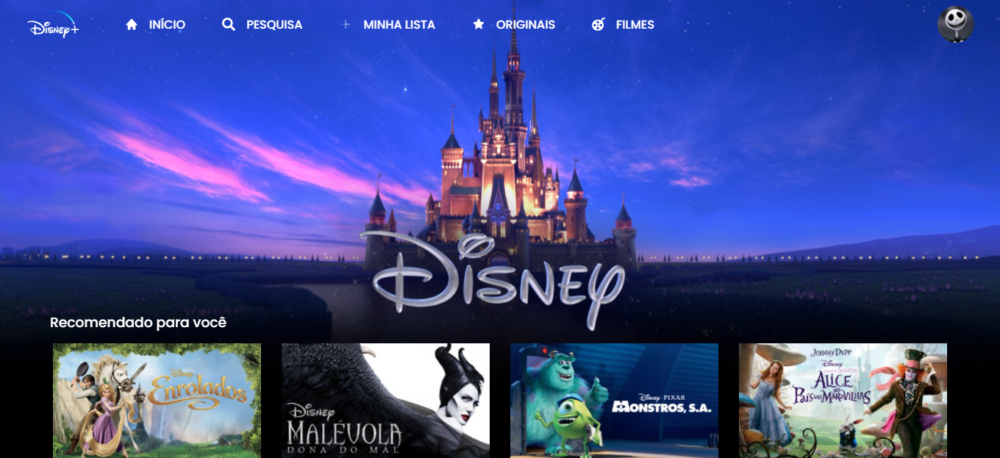
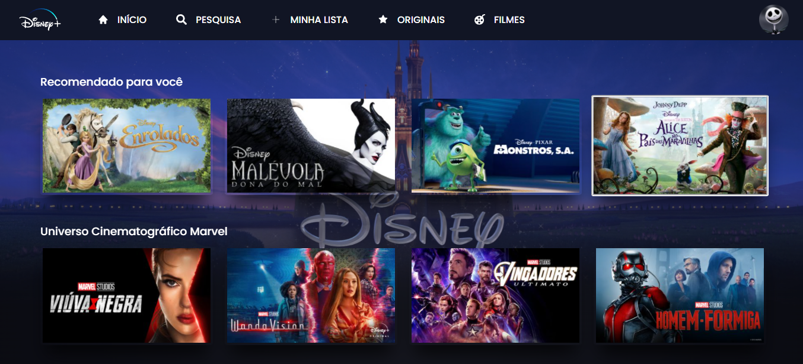
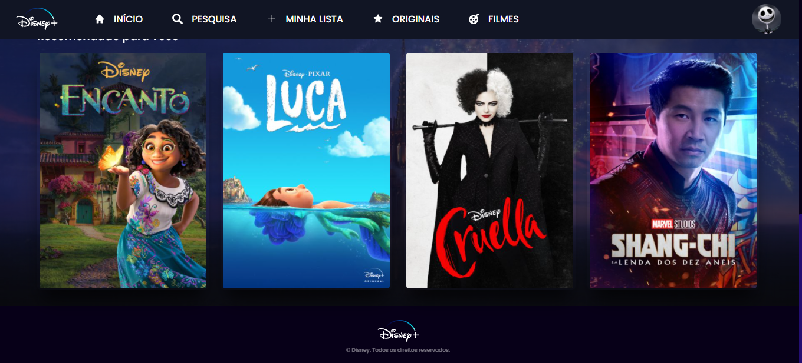

# Clone Disney+ BY Alícia Lopes

## First clone made based on Disney+ website.

Starting the project, it's possible to visualize a responsive navbar and an animation. Initial project area:

After scrolling, we can see the cards area, where different topics are shown to the user. And with due credit to Disney.

## Technologies used during the project:
- HTML
- CSS
- javascript
- GIT 

